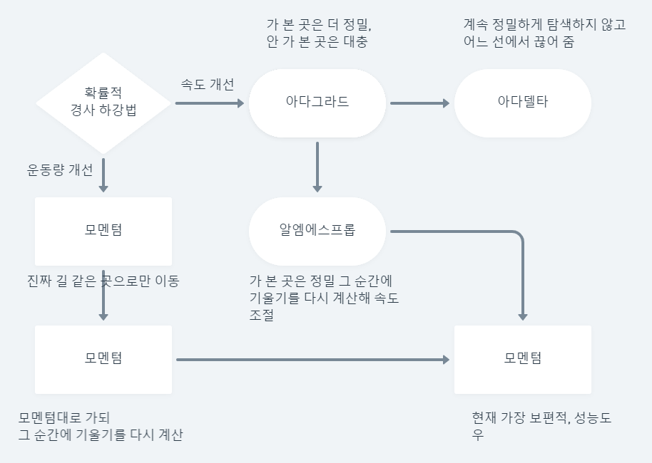

# 🔥 오차 역전파

- 오차 역전파 → 경사하강법의 확장
- 오차 역전파는 Y*out값에서 거꾸로 거슬러 올라가며 가중치 W*(2)와 가중치 W\_(1)이 더는 업데이트되지 않을 때까지 반복하여 계산하는 것
- 가중치를 수정 -> 미분 값 필요

## ✅ 출력층의 오차 업데이트

 

## ✅ 은닉층의 오차 업데이트

 

- 기울기 소실

  - 층이 늘어나면서 역전파를 통해 전달되는 이 기울기의 값이 점점 작아져 전달되지 않는 문제 발생

  - 활성화 함수 시그모이드 특성 때문

  - 해결하고자 여러 함수 대체

- 렐루 (ReLU) 함수

  - 현재 가장 많이 사용되는 활성화 함수
  - 여러 은닉층을 거치더라도 맨 처음 층까지 사라지지 않음
  - 여러 층을 쌓을 수 있다

- 고급 경사 하강법

  - 가중치를 업데이트하는 방법 → 경사 하강법
  - 계산령이 매우 많아 문제 해결해줌

- 확률적 경사 하강법

  - 전체 데이터 사용 X → 랜덤하게 추출한 일부 데이터를 사용
  - 더 빨리 자주 업데이트

- 1 epoch
  - 학습 프로세스가 모든 샘플에 대해 한 번 실행
- Batch Size
  - 샘플을 한 번에 몇 개씩 처리할지 정함

